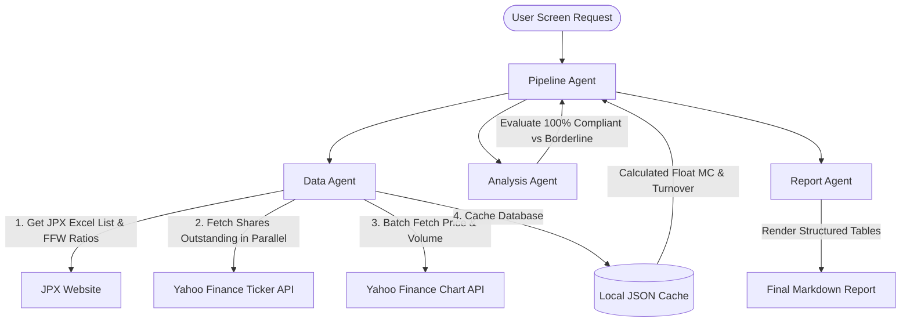

# TOPIX Restructuring Analyzer: Pre-emptive Selection Engine (2026 New Rules)
### *A Multi-Agent System for High-Frequency Quantitative Market Screening across TSE Standard & Growth Markets*

This repository contains the codebase for the **TOPIX Restructuring Analyzer**, a multi-agent quantitative screening system built for the Kaggle Capstone Project (5-Day AI Agents Course with Google). It scans all 2,161 companies in the Tokyo Stock Exchange (TSE) Standard and Growth markets to identify and analyze candidates for the upcoming October 2026 TOPIX restructuring.

**Track**: Freestyle  
**Inspired by**: *"最もホットな領域について徹底解説します"* (A thorough explanation of the hottest areas that institutional investors are currently looking at) by **Gentaro's Investment Channel [Former Institutional Investor]** ([YouTube Link](https://www.youtube.com/watch?v=JGyXqsTZqhA&t=465s)).

---

## 1. Problem Statement & Value Proposition

### The Market Event
In October 2026, the Tokyo Stock Exchange (TSE) will implement its major **TOPIX (Tokyo Stock Price Index) Restructuring (Stage 2)**. The index is moving away from segment-based membership to strict, liquidity-weighted quantitative rules. To be included or remain in TOPIX, a stock must meet:
1. **Float-Adjusted Market Capitalization (流通時価総額)** $\ge$ **40 Billion JPY** (the 96th percentile cumulative float market cap cutoff of all listed shares).
2. **Annual Trading Value Turnover Ratio (年間売買代金回転率)** $\ge$ **0.2** (annual trading value must be at least 20% of its float-adjusted market cap).

### The Inspiration
As discussed by former institutional investor Gentaro in his popular video [*"最もホットな領域について徹底解説します"* at 7:45 (t=465s)](https://www.youtube.com/watch?v=JGyXqsTZqhA&t=465s), the TOPIX restructuring represents one of the most lucrative trading opportunities in the Japanese market. Since passive index-linked funds will be forced to buy newly included stocks, retail investors can capture significant alpha by buying these candidates *pre-emptively* (先回り投資) before the passive buying pressure drives prices up.

### The Solution
Our multi-agent system automates the entire ingestion, calculation, analysis, and report generation pipeline. It connects to live market APIs, calculates free-float adjustments, screens for compliance, and generates a professional investment report with separated tables for **Strictly Eligible Candidates** and **Borderline Candidates** (with buffers at 35B–40B JPY and 0.15–0.20 turnover).

---

## 2. System Architecture

The engine is built around a modular multi-agent system coordinated by a Pipeline Agent:



* **Data Agent**: Operates deterministically via Python code. It downloads the JPX stock list, maps FFW ratios, fetches live prices/volumes in parallel, and caches the database locally.
* **Analysis Agent**: An LLM (Gemini 2.0 Flash) that reads the filtered output, performs qualitative evaluations, highlights key sectors, and discusses prominent candidates.
* **Report Agent**: Renders the final investment report in Markdown, separating the output into two tables: Eligible and Borderline.

---

## 3. Key Agent Features & Course Concepts

* **Multi-Agent Pipeline (ADK)**: Decoupled orchestration allows the system to remain mathematically precise (Python-driven Data Agent) while utilizing LLMs for cognitive summaries and professional formatting.
* **Autonomy & Self-Healing (Agent Skills)**:
  * **Direct Chart Scraper Fallback**: If standard JSON parsers (`yfinance`) fail for newly listed tickers (e.g. PowerX `485A.T`), the system dynamically scrapes raw chart data from the Yahoo Finance v8 endpoint.
  * **SSL verify=False Patching**: Bypasses local SSL certificate verify failures commonly encountered on corporate and local development environments.
  * **Automatic Threaded Initializer**: Triggers database updates on background threads automatically if the local cache is empty.
* **Performance Engineering**:
  * Utilizes a **30-thread parallel downloader** (`ThreadPoolExecutor`) to fetch shares outstanding for all 2,161 tickers in less than 30 seconds on startup.
  * Uses batch downloads (100 tickers per request) to prevent API rate-limiting.

---

## 4. Directory Structure

```
├── app.py                  # FastAPI Application Entrypoint
├── test_agent.py           # Offline Testing Harness
├── requirements.txt        # Project Dependencies
├── .gitignore              # Git Ignore File
└── topix_agent/
    ├── agent.py            # Orchestrator & LLM Agent Prompts
    ├── tools/
    │   ├── stock_data.py   # Data Ingestion, Scraping, & Calculation
    │   └── topix_stock_cache.json  # Cached Stock Database (Gitignored)
    └── frontend/           # Web Interface (HTML, CSS, Vanilla JS)
```

---

## 5. Setup & Installation

### Prerequisites
* Python 3.10+
* Google Gemini API Key

### Installation Steps
1. Clone this repository.
2. Install the required dependencies:
   ```bash
   pip install -r requirements.txt
   ```
3. Set your Google Gemini API key as an environment variable:
   ```bash
   # Windows PowerShell
   $env:GOOGLE_API_KEY="your_actual_gemini_api_key"
   
   # Linux/macOS
   export GOOGLE_API_KEY="your_actual_gemini_api_key"
   ```

4. Start the FastAPI development server:
   ```bash
   python app.py
   ```

5. Open your web browser and go to:
   ```
   http://127.0.0.1:8000
   ```

6. Click **"🔍 Start Analysis"**. The system will automatically build the database cache on the first launch (approx. 60–90 seconds) and run the screen!

---

## 6. Disclaimer

*This application is for educational purposes only. It is not financial advice. All stock data is scraped from public sources and may be subject to data lags or scraping errors. Always consult a licensed professional before making investment decisions.*
